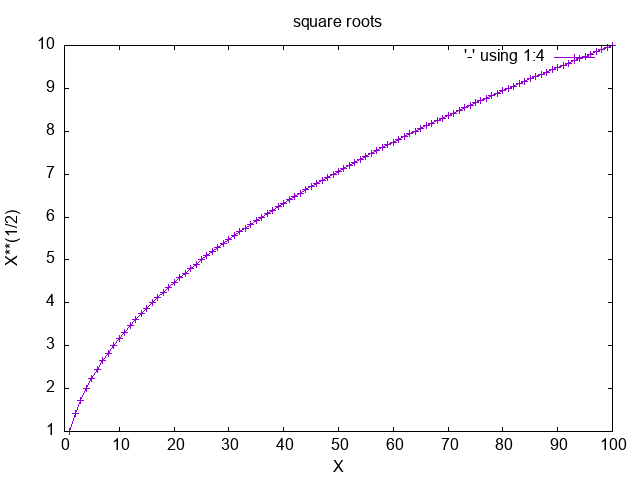

### fortran examples on mathematics topics
the program that print graphic points
can be used together with gnuplot to plot graphs.
The following instructions are given for linux.
how to use the program circle:
#
./circle <<< "10" | gnuplot -p -e "set size ratio -1;plot '-' with lines"
#
gives the image circle.png
#
the program diffsum reads 4 integers and print the difference
between the sum of the first two and the sum
of the last two
#
./diffsum
#
./gcd
#
./newtab  | gnuplot -p -e "set terminal png;set xlabel 'X'; set ylabel 'X**(1/3)';set title 'cube roots';plot '-' using 1:5 w lp" > cuberoots.png

